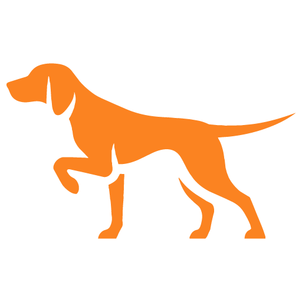
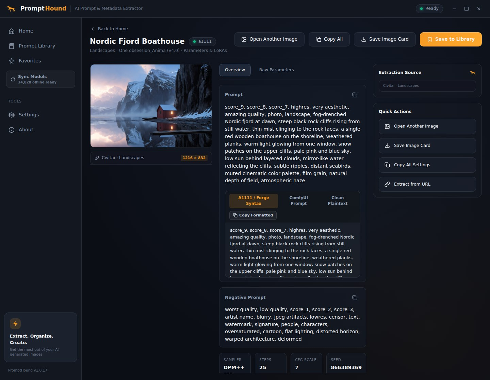
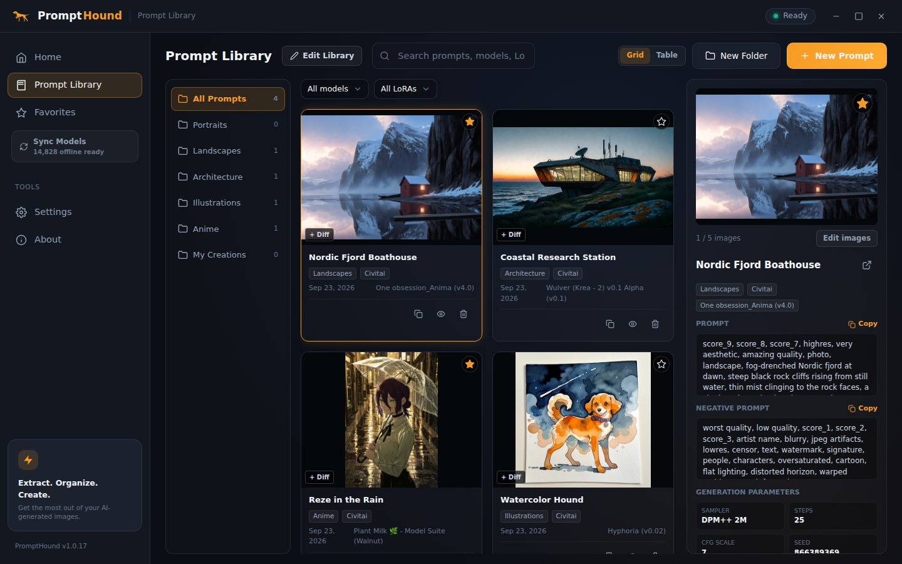
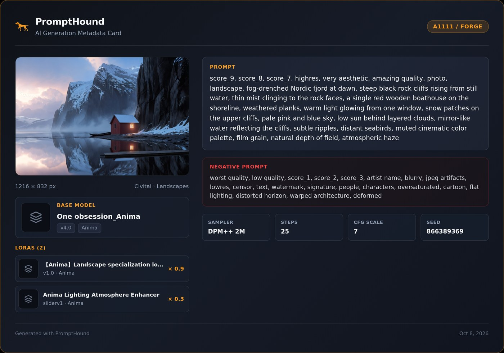

  

<h1 align="center">PromptHound</h1>

  <b>Find out how an AI image was made.</b> 
  Drop an image and get its prompt, settings, base model and LoRAs, then keep the ones you like in a searchable library.

  
  
  
  

  <a href="https://github.com/Kisaragi000/PromptHound/releases/latest"><b>⬇ Download for Windows</b></a>

  

## What it does

- **Reads the recipe from the image**: positive and negative prompt, sampler, steps, CFG, seed, size, base model and LoRAs with their weights.
- **Identifies the models**: LoRAs and checkpoints are matched by hash and Civitai id (exact), using a built-in offline catalog (about 15,000 entries) first and Civitai second. A name match is the last resort and is labeled as one.
- **Keeps a library**: folders, favorites, up to five images per prompt, grid and table views, side-by-side comparison and search.
- **Makes sharing easy**: copy the prompt as A1111 syntax, ComfyUI text or plain text, or save a clean image card with everything on it.

  
  

## Install

Get the latest files from the **[Releases page](https://github.com/Kisaragi000/PromptHound/releases/latest)** (Windows 10 or 11, 64-bit):

| File | Use it when |
| --- | --- |
| `PromptHound-Setup-<version>.exe` | You want a normal install. It needs no administrator rights, adds a Start menu entry and **updates itself**. |
| `PromptHound-<version>-Portable.exe` | You want a single file that runs from anywhere. It does not update itself. |

**Windows says "Windows protected your PC"?** PromptHound is not code-signed yet (a signing certificate costs money), so Windows SmartScreen warns about every new download. Choose **More info**, then **Run anyway**. The installers are built by GitHub Actions from the source in this repository (`.github/workflows/release.yml`).

**Updates:** the installed version checks GitHub for a newer release when it starts and every few hours, downloads it in the background and shows **Restart to update**. If you ignore it, it is installed the next time you close the app.

## Supported images

| Source | What you get |
| --- | --- |
| Automatic1111, Forge, SD.Next | Everything, including LoRAs from `<lora:...>` tags and Civitai resource lists |
| ComfyUI | The prompt that reaches the sampler (the graph is traced), plus settings and LoRAs |
| SwarmUI, Fooocus, NovelAI | Prompt and settings |
| Civitai images and links | Generation data from the post, or from the original file when you paste it |
| ChatGPT, Gemini, Firefly and others | A **"Confirmed AI-generated"** label with the service and date. These services do not store the prompt in the file, so there is none to show |

PNG, JPEG and WebP files work, whether you drop them, paste them with `Ctrl+V`, paste an image link, or right-click them in Windows Explorer and choose **Extract with PromptHound** (turn it on in Settings > Windows Integration).

## Privacy

- Your images and library stay on your PC (`%APPDATA%\PromptHound`). There is no account, no analytics and no telemetry.
- The app goes online only to: look up models on **Civitai** (hashes, ids and names, never your images), show their preview pictures, fetch the links you paste, and check **GitHub** for updates.
- A **Civitai API key is optional**. If you add one it is encrypted by Windows on your PC and is only ever sent to Civitai.

## Questions

<b>It says "Could not extract metadata"</b>

The file has no generation data. Discord, Reddit, X, screenshots and many converters remove it. Try the original file from your generator, or from the Civitai page (pasting the image link works too).

<b>Why is there no prompt for my ChatGPT or Gemini image?</b>

They label their images as AI-generated (and PromptHound shows that label), but they do not save the prompt in the file. Keep the prompt yourself with <b>New Prompt</b>, which also takes up to five images.

<b>What does the "name match" tag on a LoRA mean?</b>

The file had no hash or id, so PromptHound guessed from the name. Hash and id matches are exact; a name match deserves a quick check, and you can re-link the LoRA by hand.

<b>How do I back up or move my library?</b>

Settings > Prompt Library Backup exports every prompt, folder, favorite and image to one `.zip`, and imports it on another PC.

## For developers

Build, test and release instructions are in **[docs/DEVELOPMENT.md](docs/DEVELOPMENT.md)**. The release history is in **[CHANGELOG.md](CHANGELOG.md)**, and bug reports and ideas are welcome as [issues](https://github.com/Kisaragi000/PromptHound/issues/new/choose).

## License

[MIT](LICENSE). Made for the AI art community.
